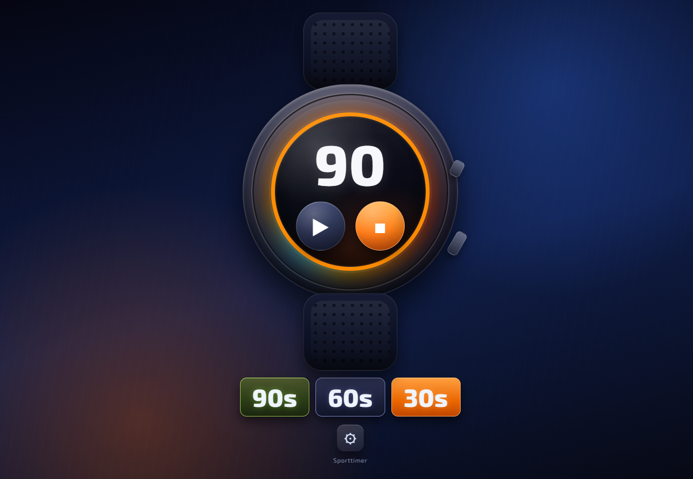

# Sporttimer Cool


A futuristic interval timer web app with a smartwatch-inspired interface, rich feedback cues, and switchable visual themes.

## Live App Files

- `index.html`: base Sporttimer version
- `index-cool.html`: enhanced "Cool Edition" with upgraded feedback and themes

## Features

- Circular progress ring with elapsed/remaining color split and glow boundary
- Preset buttons for `90s`, `60s`, and rest timer
- Adjustable timer presets and alarm behavior in settings
- Multiple alarm tones and volume control
- Smart feedback in Cool Edition:
  - Start/pause/resume cue sounds
  - Sprint feedback in final 5 seconds (audio + visual pulse)
  - Flash pulse on interval transitions
- Theme switching in Cool Edition:
  - `Neon Race`
  - `Arctic Pulse`
  - `Lava Forge`

## Run Locally

Because this is a static app, you can run it with any local static server.

Example with Python:

```bash
python -m http.server 4173
```

Then open:

- `http://localhost:4173/index-cool.html`

## Project Structure

```text
sporttimer/
  index.html
  index-cool.html
  icon sporttimer.png
  logo-sporttimer-cool.svg
  sporttimer-cool-v1.png
```

## Screenshot



## Author

Created by Joost Dijkstra.
